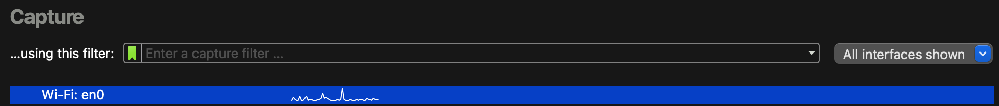
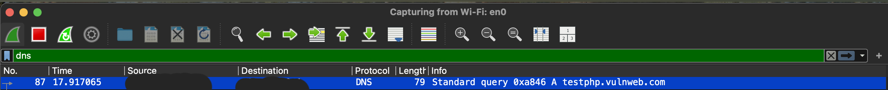
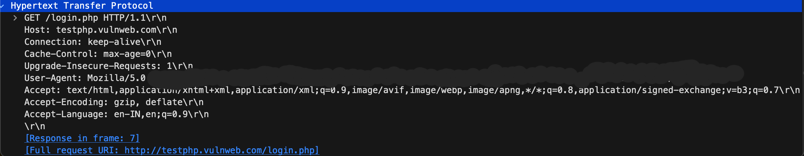
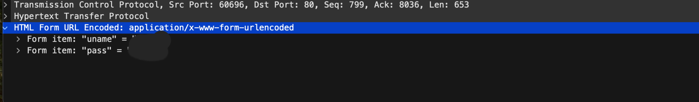

# Wireshark: Capturing Unencrypted HTTP Login Traffic

This project demonstrates how unencrypted login credentials can be captured using Wireshark when using HTTP (non-HTTPS) websites.

## 🔍 Objective
To analyze HTTP traffic and show how login credentials can be captured in plaintext during transmission.

## 📁 Captures

### 🟢 1. Start Capture

Starting packet capture in Wireshark on the `Wi-Fi` interface.

---

### 🟡 2. DNS Query

DNS query for `testphp.vulnweb.com` (used for safe testing).

---

### 🔵 3. HTTP GET Login Page

HTTP GET request made to `/login.php`.

---

### 🔴 4. HTTP POST Credentials

HTTP POST request showing form data sent in plaintext (fake credentials used).

## 🌐 Test Environment
- Target: `testphp.vulnweb.com` (public vulnerable test site by Acunetix)
- Protocol: HTTP
- Tool: Wireshark

## ⚠️ Security Notice
HTTP traffic is unencrypted. Always use HTTPS for login forms to protect credentials from interception.

## 📌 Educational Purpose
This project is for learning and demonstration purposes only. No unauthorized network scanning or packet capturing was performed.
